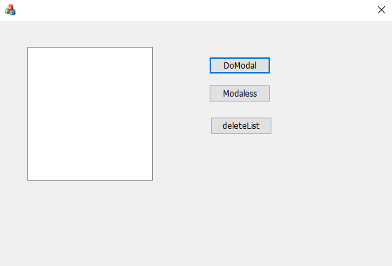
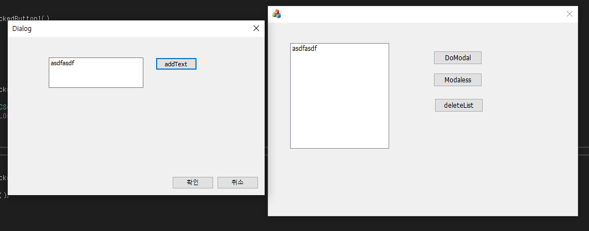
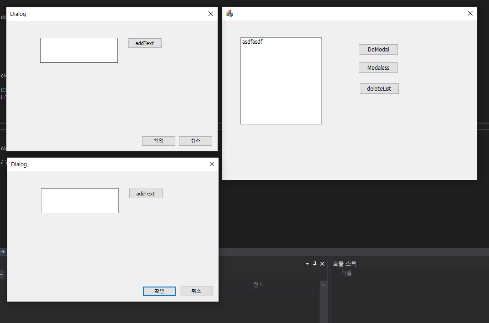
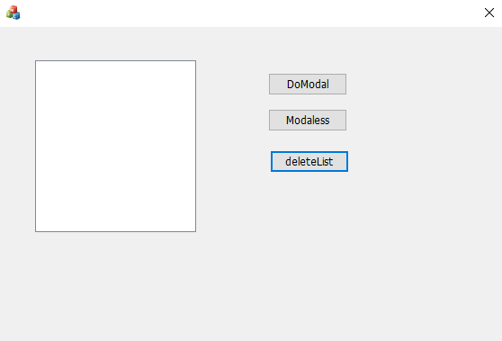

# 모달과 모달레스의 차이점

처음 창은 모달창과 모달레스창을 켤수 있는 버튼 두개, 리스트를 삭제하는 버튼이 하나 있습니다.

모달버튼을 누르면 위와 같은 새 모달이 나타나며 모달창을 더 띄울 수 없다.

다음은 모달레스 버튼을 누르면 나오는 창이다. 모달레스 버튼을 누르면 위와 같이 여러개의 창을 띄울 수 있다. 

다음은 리스트박스의 내용을 모두 삭제하는 버튼이다.
